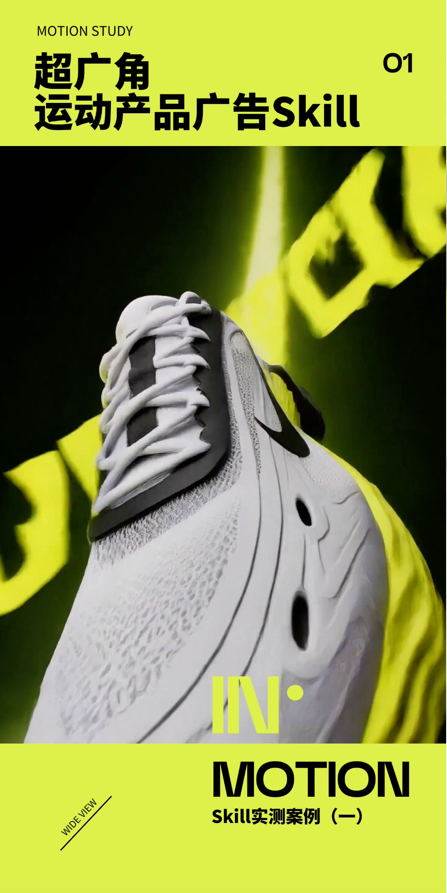
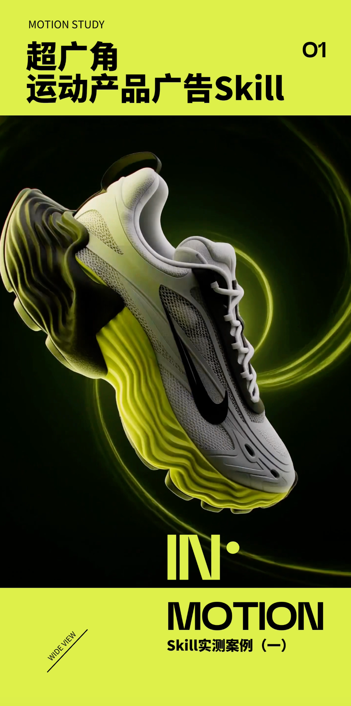
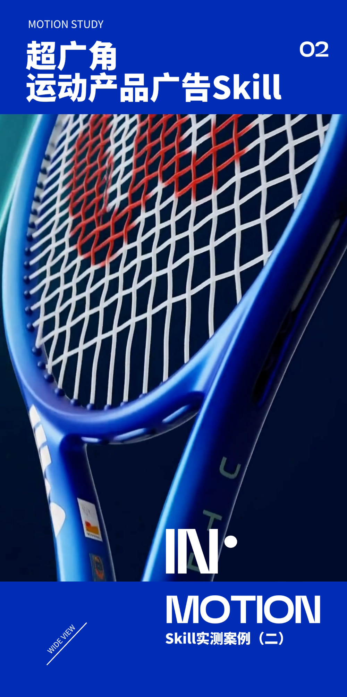
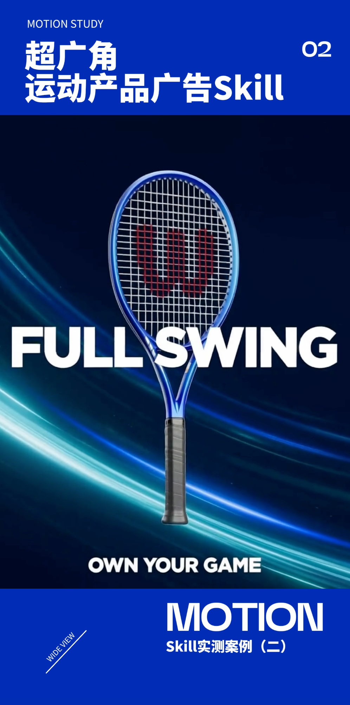

# 超广角运动产品广告 Skill

**给一张产品图，让 Codex 帮你设计一条有速度感的产品广告。**

作者：不二何

这个 Skill 把产品分析、广告文案、七镜头分镜和视频提示词串成一套可复用流程，再通过 LibTV 调用 Minimax H3 生成短片。适合希望用 AI 制作产品视觉、广告样片和运镜实验的设计师与创作者。

## 效果预览

**[查看 / 下载实测案例预览视频](docs/media/demo.mp4)**

<p>
  
  
</p>
<p>
  
  
  
</p>

以上图片与视频由作者整理提供，包含运动鞋和网球拍两个实测案例。更多信息见 [素材说明](docs/MEDIA.md)。

## 它能做什么

- 看产品图，分析轮廓、材质、配色和可拍摄的细节。
- 根据产品提出广告短句，或沿用你指定的文案。
- 将产品适配到固定的七段镜头结构，写出可直接审查的完整提示词。
- 确认方案后，通过 LibTV 一次生成包含多个镜头的完整广告。
- 检查实际视频中的产品外观、运镜、文字与声音，保留提示词和参数供继续修改。

适合以单一主体展示的运动鞋、球拍、耳机、手表、鼠标等产品。复杂功能演示、人物剧情和精准工程结构展示不属于这套模板的主要用途。

## 需要准备什么

| 准备项 | 说明 |
| --- | --- |
| Codex | 能使用本地 Skill，并能读取你提供的产品图片 |
| 一张清晰产品图 | 主体完整、颜色和细节可辨；使用自己有权使用的素材 |
| LibTV 插件 / 工具连接 | 完整生成流程需要在 Codex 中连接并登录；只复制 Skill 不会自动安装连接 |
| 可用的视频生成额度 | 当前账号须能调用 Minimax H3；生成消耗平台额度，Skill 不附带免费次数 |
| 广告文案（可选） | 可指定标题和标语，也可让 Codex 拟定 |

只做产品分析、分镜和提示词时，可以不连接 LibTV。生成前请让 Codex 检查连接、模型、规格和用量。若环境缺少 LibTV 连接，先按插件提供方的说明配置，不要把普通网页登录视为已经接通 Codex 工具。

不需要提前安装 C4D、After Effects 或剪映。后期文字修复、配乐或剪辑可以另行处理；这套 Skill 本身不包含这些软件。

## 安装

### 方法一：复制给 Codex，自动安装（推荐）

**把下面整段话复制到 Codex 对话框发送即可，无需手动下载或解压：**

```text
请帮我安装这个超广角运动产品广告 Skill：
https://github.com/youngerweb2026/ultra-wide-product-ad/tree/main/skills/ultra-wide-product-ad

请使用可用的 skill-installer，将链接中的完整文件夹安装为我的个人 Skill，包含 SKILL.md、agents 和 references。若没有安装工具，请按当前环境支持的 Skill 目录完成安装。已有同名 Skill 时，先比较版本，不要直接覆盖。安装后检查文件是否齐全，并告诉我如何调用；这次只安装，不生成视频。
```

Codex 用户也可以发送这条简短指令：

```text
$skill-installer install https://github.com/youngerweb2026/ultra-wide-product-ad/tree/main/skills/ultra-wide-product-ad
```

安装完成后，在下一轮对话输入 `$ultra-wide-product-ad` 查找；如果没有出现，可重新启动 Codex 后再试。

这种方式需要智能体能联网下载文件，并有本地 Skill 安装权限。其他支持 Skill 的智能体也可以接收上面的自然语言安装请求，但安装目录与兼容性需由它检查。安装本 Skill 不会自动安装或登录 LibTV；生成视频仍需先连接 LibTV 并具备可用额度。

### 方法二：下载后让 Codex 安装

下载并解压仓库，将其中的 `skills/ultra-wide-product-ad` 文件夹交给 Codex，然后说：

```text
请把这个 ultra-wide-product-ad 文件夹安装为我的个人 Skill，检查 SKILL.md 和 references 是否完整。如果已有同名 Skill，先说明版本差异，不要直接覆盖。
```

安装后输入 `$ultra-wide-product-ad` 查找。没有出现时重新启动 Codex，再检查是否多套了一层目录。

### 方法三：手动放入 Skill 目录

把完整的 `ultra-wide-product-ad` 文件夹复制到：

- 个人使用：`~/.agents/skills/ultra-wide-product-ad/`
- 仅当前项目使用：`你的项目/.agents/skills/ultra-wide-product-ad/`

正确结构应当是：

```text
ultra-wide-product-ad/
├── SKILL.md
├── agents/
│   └── openai.yaml
└── references/
    ├── shot-and-prompt.md
    ├── source-prompt.txt
    ├── libtv-workflow.md
    └── acceptance.md
```

不要只复制 `SKILL.md`，它会引用其他文件。已有同名文件夹时先备份或比较，不要直接覆盖。目录及发现机制依据 [OpenAI 官方 Skill 文档](https://learn.chatgpt.com/docs/build-skills)，核对日期：2026-09-21。

## 一句话调用

上传产品图，然后发送：

```text
使用 $ultra-wide-product-ad，把这张产品图做成约 10 秒的超广角运动广告。文案由你拟定，先展示完整提示词和生成参数，等我确认后再通过 LibTV 生成。
```

如果暂时只要提示词：

```text
使用 $ultra-wide-product-ad，分析这张产品图并写出七镜头广告提示词。只交付方案，不提交视频生成。
```

如果已有文案：

```text
使用 $ultra-wide-product-ad，主标题用 FULL SWING，标语用 OWN YOUR GAME。配色跟随产品，先给我完整提示词和本次生成范围。
```

## 实际使用流程

1. **提供产品图。** Codex 给出产品分析与配色建议，标明需要 AI 补全的不可见区域。
2. **选文案。** 选择建议方案或提供自己的文字；已经要求自动拟定时会直接编入方案。
3. **看完整生成包。** 确认七镜头提示词、参考图、文案、模型、时长、画幅、声音方案和本次用量。
4. **确认后生成。** 通过 LibTV 提交一条完整广告，不默认拆成七条收费视频。
5. **看片与交付。** 检查实际结果，保存视频、提示词和必要参数；没有额外授权不会自动付费重试。

默认实际视频提示词使用中文，画面广告文案可选英文、中文或组合。提示词语言和画面文字是两件事。

## 常见问题

**一张图就够吗？** 够开始。未展示的底面或背面可能由 AI 补全，不能作为真实产品结构的证据；有补充视角时可以一并提供。

**一定能严格出现七个镜头吗？** 七镜头是制作目标。复杂旋甩、擦镜、扫光和文字仍可能执行不准，需要检查实际视频。

**能换产品颜色、画幅和时长吗？** 可以提出要求，配色默认跟随原产品。参数先检查当前模型是否支持，再确认执行方案。

**能换其他视频平台吗？** 可以取用分镜和提示词手动尝试；本包的自动执行流程针对 LibTV。其他平台需要另外适配输入、参数与任务恢复逻辑。

**生成后只想修改一处怎么办？** 指出时间点和问题。整片重生成可能影响其他镜头；局部修复或后期处理需明确范围与新增用量。

## 文件说明

- `skills/ultra-wide-product-ad/`：完整、可安装的 Skill。
- `docs/media/`：作者提供的预览图和实测案例视频。
- `docs/MEDIA.md`：演示来源、处理方式和媒体使用边界。

本仓库不包含 LibTV 客户端、模型权重、账号、密钥或生成额度。

## 使用与修改许可

暂不授予额外的转载、修改、再分发或商用许可。

演示中的产品外观、品牌标识、字体与音频等素材不因 Skill 的授权而自动获得第三方授权。演示素材的使用边界单独见 [素材说明](docs/MEDIA.md)。
